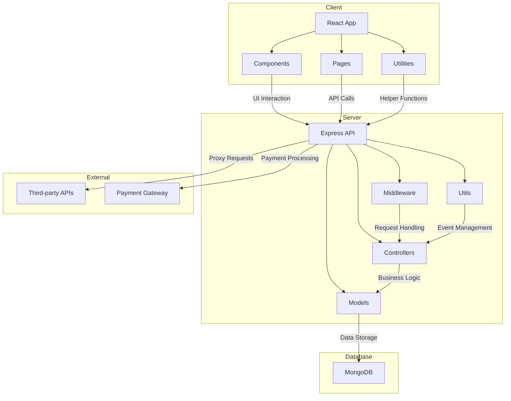

    

    <b>Automatic Architecture Diagrams from Code</b> 
    <a href="https://github.com/swark-io/swark">GitHub</a> • <a href="https://swark.io">Website</a> • <a href="mailto:contact@swark.io">Contact Us</a>

## Usage Instructions

1. **Render the Diagram**: Use the links below to open it in Mermaid Live Editor, or install the [Mermaid Support](https://marketplace.visualstudio.com/items?itemName=bierner.markdown-mermaid) extension.
2. **Recommended Model**: If available for you, use `claude-3.5-sonnet` [language model](vscode://settings/swark.languageModel). It can process more files and generates better diagrams.
3. **Iterate for Best Results**: Language models are non-deterministic. Generate the diagram multiple times and choose the best result.

## Generated Content
**Model**: GPT-4o - [Change Model](vscode://settings/swark.languageModel)  
**Mermaid Live Editor**: [View](https://mermaid.live/view#pako:eNptUstO6zAQ_ZWR1_QHurhS82gTaKWKwiphYZIhteTYwXagEeHfGTvJVZBYnofHZ479xSpdI9uyUjWGd1d4SkoFYPvXCcZSoHKeAtgVj8grB7uue5mYqIh122lFFjtTcXHmDS4oKZ6dkMKJ_8wONpt_EK1BvAbhelR1qX7luKD5QDMZ0yK9dQathd05n8fuKYlyRkuJZrnqUJxoN7nArDiJupb4yQ3OVB7iLYY0BNivwWENsjXI_86ZcMdfucXJek8JVKOT6OVvd3pzaBSXk_uheLoKU286btzgd1uCHanToaWS4cAd5R9-j4t8oPE5h1zROHohodUIqZfiINEoiLmUdmaTwGYoOzSw71U4sYj7IEa9FcpXfNSNqMapiEOQ_IpwcdrQO49w74UsCI_43qN1kHFVS6GaceoyD2L64fOfuKJTfpVZDGWOZ6NvA8znKcjDSpo3J0tFecLYY6nYHWvRtFzU9He_SuauNLVkWyhZjW-8l65k32Tqu5oqSwSnwlu2dabHO8Z7py-DqhZsdN9c2faNS4vfP7Zf-Vs) | [Edit](https://mermaid.live/edit#pako:eNptUstO6zAQ_ZWR1_QHurhS82gTaKWKwiphYZIhteTYwXagEeHfGTvJVZBYnofHZ479xSpdI9uyUjWGd1d4SkoFYPvXCcZSoHKeAtgVj8grB7uue5mYqIh122lFFjtTcXHmDS4oKZ6dkMKJ_8wONpt_EK1BvAbhelR1qX7luKD5QDMZ0yK9dQathd05n8fuKYlyRkuJZrnqUJxoN7nArDiJupb4yQ3OVB7iLYY0BNivwWENsjXI_86ZcMdfucXJek8JVKOT6OVvd3pzaBSXk_uheLoKU286btzgd1uCHanToaWS4cAd5R9-j4t8oPE5h1zROHohodUIqZfiINEoiLmUdmaTwGYoOzSw71U4sYj7IEa9FcpXfNSNqMapiEOQ_IpwcdrQO49w74UsCI_43qN1kHFVS6GaceoyD2L64fOfuKJTfpVZDGWOZ6NvA8znKcjDSpo3J0tFecLYY6nYHWvRtFzU9He_SuauNLVkWyhZjW-8l65k32Tqu5oqSwSnwlu2dabHO8Z7py-DqhZsdN9c2faNS4vfP7Zf-Vs)

