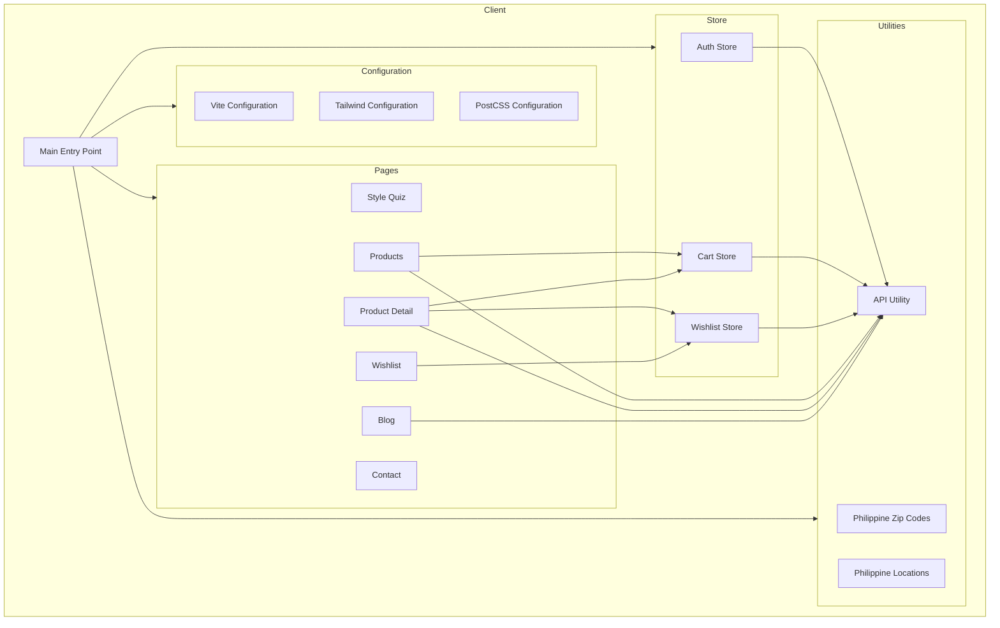

    

    <b>Automatic Architecture Diagrams from Code</b> 
    <a href="https://github.com/swark-io/swark">GitHub</a> • <a href="https://swark.io">Website</a> • <a href="mailto:contact@swark.io">Contact Us</a>

## Usage Instructions

1. **Render the Diagram**: Use the links below to open it in Mermaid Live Editor, or install the [Mermaid Support](https://marketplace.visualstudio.com/items?itemName=bierner.markdown-mermaid) extension.
2. **Recommended Model**: If available for you, use `claude-3.5-sonnet` [language model](vscode://settings/swark.languageModel). It can process more files and generates better diagrams.
3. **Iterate for Best Results**: Language models are non-deterministic. Generate the diagram multiple times and choose the best result.

## Generated Content
**Model**: GPT-4o - [Change Model](vscode://settings/swark.languageModel)  
**Mermaid Live Editor**: [View](https://mermaid.live/view#pako:eNqFVNtunDAQ_RXLz8kP7EOldLcPlVqJijSRChFywAsjeW1qjxttovx7x4BNgF3lxcycc2Y8F4s3XptG8h0vdWtF37H7Q6kZc_55dPcKpMYAfQSNPkLrrUAweuQY-wcoq3pgigeyl6qnKEMB6gV0E6X3k39F3huHtXNRnZG7z_OLYqmbVZ2_ERQgSJeydQT0PWhZvUJfhdZdkSWQ_YGeUhP4dCFCmXq4bhHxI4IpQvRQebq4uMu-TxWcr1aYo7EyRXrsKheQ4o7MkUx5a2FxYvdkrtgXcJ0CFxWPk7tQba_PRDsPx-FZyeqvh9ciDyb7ReY8CGsaXyM1Pxlrpmpk2G3k2WFw5_KNRlFjsR-_CX9Wpi2-0rFpJTWxLv8kQBc_6WDfNNozywzoUTRIghEk7Pb2y_apJmbxOBKaFpKQaUYBmxc0MHHTgZq3s6GWq1nRQRBHu4lcTnZDh9F9lm6u60rCTwXL8j82dJHmN_wkLU2voZ_KW8mxkydZ8h0reSOPwiss-TuJfN8IlAcQ9BJPfIfWyxtOAzb5WdfRt8a3Hd8dhXLy_T9mrZ9R) | [Edit](https://mermaid.live/edit#pako:eNqFVNtunDAQ_RXLz8kP7EOldLcPlVqJijSRChFywAsjeW1qjxttovx7x4BNgF3lxcycc2Y8F4s3XptG8h0vdWtF37H7Q6kZc_55dPcKpMYAfQSNPkLrrUAweuQY-wcoq3pgigeyl6qnKEMB6gV0E6X3k39F3huHtXNRnZG7z_OLYqmbVZ2_ERQgSJeydQT0PWhZvUJfhdZdkSWQ_YGeUhP4dCFCmXq4bhHxI4IpQvRQebq4uMu-TxWcr1aYo7EyRXrsKheQ4o7MkUx5a2FxYvdkrtgXcJ0CFxWPk7tQba_PRDsPx-FZyeqvh9ciDyb7ReY8CGsaXyM1Pxlrpmpk2G3k2WFw5_KNRlFjsR-_CX9Wpi2-0rFpJTWxLv8kQBc_6WDfNNozywzoUTRIghEk7Pb2y_apJmbxOBKaFpKQaUYBmxc0MHHTgZq3s6GWq1nRQRBHu4lcTnZDh9F9lm6u60rCTwXL8j82dJHmN_wkLU2voZ_KW8mxkydZ8h0reSOPwiss-TuJfN8IlAcQ9BJPfIfWyxtOAzb5WdfRt8a3Hd8dhXLy_T9mrZ9R)

