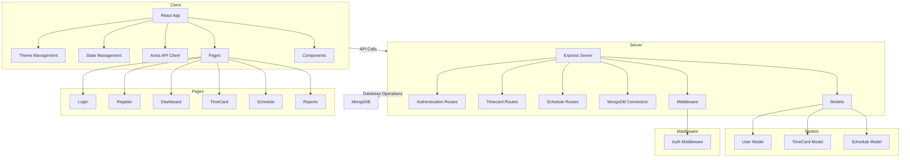

    

    <b>Automatic Architecture Diagrams from Code</b> 
    <a href="https://github.com/swark-io/swark">GitHub</a> • <a href="https://swark.io">Website</a> • <a href="mailto:contact@swark.io">Contact Us</a>

## Usage Instructions

1. **Render the Diagram**: Use the links below to open it in Mermaid Live Editor, or install the [Mermaid Support](https://marketplace.visualstudio.com/items?itemName=bierner.markdown-mermaid) extension.
2. **Recommended Model**: If available for you, use `claude-3.5-sonnet` [language model](vscode://settings/swark.languageModel). It can process more files and generates better diagrams.
3. **Iterate for Best Results**: Language models are non-deterministic. Generate the diagram multiple times and choose the best result.

## Generated Content
**Model**: GPT-4o - [Change Model](vscode://settings/swark.languageModel)  
**Mermaid Live Editor**: [View](https://mermaid.live/view#pako:eNp1k8Fu4yAQhl8FcW5fIIeVHDtt08ZNGjvtAfdAzNRGssEC3O2q7bsvBuIl2vTG98944B_PfOJaMsALXIlG0aFFZVYJhPR49Jh2HISZJIQSsgdaG5QMw6tXlqRsoQeUU0EbexAmBFJSGGouBDKSfHCpUbJbh9ohsCI7m6kD3ZBU9oMUNn6SEnR9_QstY0hjyGJYxXAzAQhWiTNrBah3UD7xlqw-BgVaBzXceUeS0bT2EbymhkuB9nI08yPXpOQ91FSxc_2eFHULbOzgXH8guRSNzJYolUJAPVUMoQ3JOWMd_KYKgpTbbAbd6eNbZ-UuhnUM9zE8xLCJIb_cC3-VT3wkBw3KS-HyrXOaTk5jeffPaCzn7qbHGLYx7H54w9wBn_zkmo_-a8zGFXm6XMQNkc_bk41s-KnDhR3ehmsz_9uSZFS3R2lNBeUwuwzC8-wvCC-2yCDVPJMr95R9DEUMZQyHGJ5jeDnz4tdiCny5LaFdp7-iafUnF8-ooUeqAW0HUG5CbWYYskrgK9yD6ilndr8_K2ymXa3wAlWYwRsdO1Phb5s0DszuasapbWGPF0aNcIXpaGTxR9QnVnJsWrx4o52G778YS0fV) | [Edit](https://mermaid.live/edit#pako:eNp1k8Fu4yAQhl8FcW5fIIeVHDtt08ZNGjvtAfdAzNRGssEC3O2q7bsvBuIl2vTG98944B_PfOJaMsALXIlG0aFFZVYJhPR49Jh2HISZJIQSsgdaG5QMw6tXlqRsoQeUU0EbexAmBFJSGGouBDKSfHCpUbJbh9ohsCI7m6kD3ZBU9oMUNn6SEnR9_QstY0hjyGJYxXAzAQhWiTNrBah3UD7xlqw-BgVaBzXceUeS0bT2EbymhkuB9nI08yPXpOQ91FSxc_2eFHULbOzgXH8guRSNzJYolUJAPVUMoQ3JOWMd_KYKgpTbbAbd6eNbZ-UuhnUM9zE8xLCJIb_cC3-VT3wkBw3KS-HyrXOaTk5jeffPaCzn7qbHGLYx7H54w9wBn_zkmo_-a8zGFXm6XMQNkc_bk41s-KnDhR3ehmsz_9uSZFS3R2lNBeUwuwzC8-wvCC-2yCDVPJMr95R9DEUMZQyHGJ5jeDnz4tdiCny5LaFdp7-iafUnF8-ooUeqAW0HUG5CbWYYskrgK9yD6ilndr8_K2ymXa3wAlWYwRsdO1Phb5s0DszuasapbWGPF0aNcIXpaGTxR9QnVnJsWrx4o52G778YS0fV)

